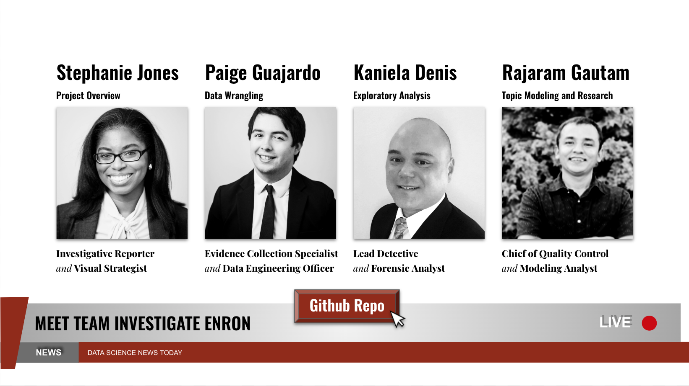

# Getting Ahead of the Headline | Enron Topic Modeling
<!-- Analyzing employee emails using Natural Language Processing, Sentiment Analysis, and Time Series Analysis  -->

Codeup, Hopper Cohort | March 2022 

# About the Project
In this unsupervised machine learning project we explored a corpus of over 500k Enron employee emails from ~150 unique users, mostly in senior management. 
  
Click [here]() to check out the video recording where we present our project process and findings!
<!-- and analyzing Enron employee emails. We are using topic modeling, sentiment analysis, and time series analysis to identify trends in communication themes over time. For our MVP we are looking at a corpus of 5,575 emails sent by people of interest, as identified by the official congressional report on the role of Enron's board of directors (https://bit.ly/3Hjz5rI) on the collapse of the company.  -->

## Background
Founded in 1985, Enron was a major American energy and commodity trading company. After over a decade of reporting exponential profits and record breaking growth, the company declared bankruptcy in December 2001.
  
It was later determined that lenient financial laws allowed Enron to exploit regulatory loopholes and get away with hiding hundreds of millions of dollars in losses and take on risky investments betting with public utilities servies, making the company appear much more profitable than it actually was.
<!-- Enron has become synonymous with willful corporate fraud and corruption. The scandal also brought into question the accounting practices and activities of many other corporations, leading to the enactment of stricter financial legislation and reporting requirements. The scandal also affected the greater business world by causing the dissolution of the Arthur Andersen accounting firm, which had been Enron's main auditor for years. -->

## Our Goal
To reverse engineer the Enron case and look for patterns, trends, and insights in the corpus of executive emails that will give us clues about what was going within the company, prior to its collapse

## Initial Hypothesis
Initially, we believed that analyzing employee sentiment would differ at different points throughout the timeline of Enron's collapse, giving us clues as to what was happening internally with the compnay.

## Our Findings
We found that sentiment scores were relatively steady throughout the timeline of the company's collapse and decided to explore topic modeling. We found that we could you topic clusters to generate keyword clusters in employee emails, allowing us to match distinct keywords with actual events within the company during its collapse.

# Data Dictionary
variable | dtype | description
:-- | :-- | :--
`date` | datetime | date email was sent
`file` | object | email file path (storage)
`sender` | object | email sender email address
`subject` | object | text of email subject
`content` | object | raw email content
`lemmatize` | object | cleaned and lemmatized email content
`intensity` | float | vader sentiment intensity analyzer score
`polarity` | float | measure of email sentiment, -1 (neg) to 1 (pos)
`subjectivity` | float | measure of email subjectivity, 0 (obj), 1 (sub)
`poi` | bool | is person directly connected to investigation
`is_internal` | bool | True == email was sent from Enron address

# Persons of Interest
Using the text from the [Senate investigation report](https://www.govinfo.gov/content/pkg/CPRT-107SPRT80393/html/CPRT-107SPRT80393.htm), we identified Enron executives linked to the investigation who we identified as persons of interest based on their role in the congressional investigation.
<!-- Will add table later with more time, for now commenting this section out -->
<!-- Name | Connection to Enron | Enron Investigation
:-- | :-- | :---
Name | Role at Enron | Investigated/indicted/fired -->

# Data Science Pipeline 
## Planning
We used a [Trello Board](https://trello.com/b/osnQZqjJ/enronnlp-project) for planning.

## Data Wrangling
- We acquired our data from [Kaggle](https://www.kaggle.com/wcukierski/enron-email-dataset)
- We used the [email.parser]() Python library to parse out the following contents from the message content:
  - Date
  - Subject
  - Sender
  - Content
- We performed the following cleaning steps on the contents of the email text
  - lowercased and stripped out unecessary white space
  - used regex to remove special characters and normalized the text 
  - created tokens from the text strings and removed the stop words
  - lemmatizing the tokens and then rejoining the processed tokens back to a string
  - filled null values with empty string
Feature Engineering
- `is_poi` Person of Interest from Sender
- `is_internal` Email originated from @enron.com address from Sender
- `month` and `year` from Date
- `intensity` (Vader) and `polarity` and subjectivity from (Textblob)

## Exploratory Analysis
- What are the distributions of continuous and boolean variables?
> Intensity mostly positive and neutral, polarity and subjectivity  mosty neutral 
Most email sent from @enron.com email, from a non-Person of Interest
<!-- >`intensity` left skewed - a lot of positive and nuetral values 
`polarity` and `subjectivity` normal-*ishly* distributed mostly neutral 
Most emails between 1999 - 2002 
83% of emails sent from @enron.com email 
Only 1.08% emails sent from a Person of Interest --> 

- Was there a difference in sentiment scores for each year?
>For each of three sentiment scores there was almost no difference in each sentiment score from year to year

- Did sentiment scores between Persons of Interest differ significantly from non-Persons of Interest?
>There was no significant difference in sentiment scores between Persons of Interest and non-Persons of Interest

- How correlated were each of the three sentiment scores with one another?
> There was correlation between the three sentiment measures but it was very low. 

- Were there any seasonal trends in monthly employee sentiment
> No, but there were large dips for x3 months from 1999 - 2002

## Modeling
We used the `BERTopic` algorithm for topic modeling and looked at common topics for all emails from persons of interest by year, from 2000 to 2002. Initially, we planned to include 1999 but there were not enough emails for that year to generate topics from this algorithm. 

## Conclusions
### Key Takeways
- Sentiment analysis of this nature (positive/negative or subject/objective) is not useful when looking at corporate, professional communications
> Better use cases: general public sentiment (e.g. social media analysis or insights from [anonymous] employee surveys, where communication is more informal)

- Topic modeling can provide early insights in investigative inquiries, by finding patterns in keywords and grouping similar themes. 

### Recommendations
#### I. Lessons in Corporate Communication
Something that Enron did very well was communicate. Hindsight is 20/20 and while we certainly do not agree with misrepresenting financial reports or hiding corporate losses it is clear from the official investigations and from our analysis that many employees were completely unaware of the wrongdoing within the company. Even at the worst of times, official corporate communications mainatined a nuetral and professional tone. 

#### II. Tranparency, accountability, and monitoring (early)
We recommend companies have systems in place that can track reports of suspicious activity as well as checks and balances for accountability. Many of the financial regulations mandates this kind of transparency and accoutability, but we also recommend using exploratory analysis and this kind of topic modeling, regularly (i.e. employee satisfaction surveys, recommendation and feedback requests, etc.) to track them and highlight vulnerabilities early, before they become major problems.

### If we had more time:
- Scale x3 sentiment scores
- Explore Word Frequency Analysis with Email Subject
- Explore email recipients
- Explore and model with non-POI and POI emails (not just POI)
- Explore clustering with the three different measures for sentiment
- Explore variables related to persons of interest, such as tenure with the company, salary, and investigation outcome

# Steps to Recreate
1. Read this README.md file 
2. Ensure you have latest version of Python and libraries (listed below) installed 
3. Clone this repository, download the project files listed below, and run the final_report notebook. 

## Python Libraries:
Library | Import Code | Documentation
:-- | :-- | :-- 
Pandas | `import pandas as pd` | https://pandas.pydata.org/docs/
Numpy | `import numpy as np` | https://numpy.org/doc/ 
email.parser | `from email.parser import Parser` | https://docs.python.org/3/library/email.parser.html
datetime | `import date_time` | https://docs.python.org/3/library/datetime.html
Vader, Sentiment Analysis | `from nltk.sentiment.vader import SentimentIntensityAnalyzer` | https://www.nltk.org/_modules/nltk/sentiment/vader.html 
Textblob, Sentiment Analysis | `from textblob import TextBlob` | https://pypi.org/project/textblob/
Bertopic, Topic Modeling | `from bertopic import BERTopic` | https://pypi.org/project/bertopic/

## Project Files
file_name | Description | Location
:-- | :-- | :--
`enron_presentation.mp4` | video recording | [Dropbox](https://www.dropbox.com/s/qjb2shljg3c4dlz/enron_presentation.mp4?dl=0)
`00-raw_emails.csv` | raw project data | [Dropbox](https://www.dropbox.com/s/68kxcc9bt5skrcl/00_raw_emails.csv.zip?dl=0)
`01-wrangle_df` | cleaned and prepared data | [Dropbox](https://www.dropbox.com/home/Enron-NLP_Capstone)
`02-time_series_df.csv` | time series data | [Dropbox](https://www.dropbox.com/s/mhh93ol0zwrx7zt/02_time_series_df.csv.zip?dl=0)
`03-poi.csv` | clean data - poi only | [Dropbox](https://www.dropbox.com/s/y08c4yrzw7ztici/03-poi.csv?dl=0)
`final_report.ipynb` and modules | final report notebook | Github repo --> [main folder](https://github.com/Enron-Discussion-NLP/Capstone)
`enron_slides` | Slideshow Presentation | [Google Slides](https://docs.google.com/presentation/d/1KM1KkuBkSML_DybBiUxNsKrx8HXkyizbOgJVOqnNruI/edit?usp=sharing)

# References and Citations
Bert topic model:
>@misc{grootendorst2020bertopic,
  author       = {Maarten Grootendorst},
  title        = {BERTopic: Leveraging BERT and c-TF-IDF to create easily interpretable topics.},
  year         = 2020,
  publisher    = {Zenodo},
  version      = {v0.9.4},
  doi          = {10.5281/zenodo.4381785},
  url          = {https://doi.org/10.5281/zenodo.4381785}
}

Wikipedia 
>- [Enron](https://en.wikipedia.org/wiki/Enron)
>- [Enron Scandal](https://en.wikipedia.org/wiki/Enron_scandal)
>- [Enron Corpus](https://en.wikipedia.org/wiki/Enron_Corpus)
>- [California Energy Crisis, 2000-2001](https://en.wikipedia.org/wiki/2000%E2%80%9301_California_electricity_crisis)

Data Source
>Will Cukierski, [Kaggle](https://www.kaggle.com/wcukierski/enron-email-dataset) (2015, May)

Congressional Report on the Role of Enron Board of Directors in Enron's Collapse 
>https://www.govinfo.gov/content/pkg/CPRT-107SPRT80393/html/CPRT-107SPRT80393.htm

