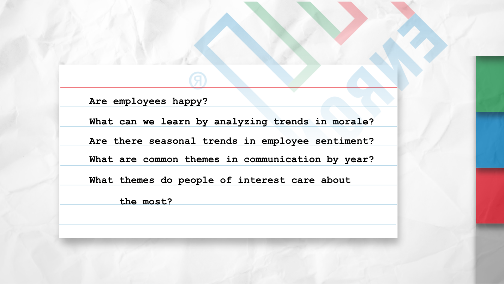

# Getting Ahead of the Headline 
Analyzing employee emails using Natural Language Processing, Sentiment Analysis, and Time Series Analysis 

Enron Topic Modeling | Codeup, Hopper Cohort | March 2022  
>Paige Guajardo 
Rajaram Gautam 
Stephanie Jones 
Kaniela Denis  

# About the Project

In this unsupervised machine learning project we are exploring and analyzing Enron employee emails. We are using topic modeling, sentiment analysis, and time series analysis to identify trends in communication themes over time. For our MVP we are looking at a corpus of 5,575 emails sent by people of interest, as identified by the official congressional report on the role of Enron's board of directors (https://bit.ly/3Hjz5rI) on the collapse of the company. 

## Initial Hypothesis

Our initial hypothesis is that there will be distinct trends in email topics and sentiment over time. 

## Background

Enron Corporation was a major American energy, commodities, and services company that declared bankruptcy in December 2001 after over a decade of fraudulent accounting practices. During an error of more lenient financial regulations and high market speculation, Enron hid its financial losses in special purposes entities, making it appear much more profitable on paper than it actually was.
  

Enron has become synonymous with willful corporate fraud and corruption. The scandal also brought into question the accounting practices and activities of many corporations in the United States and was a factor in the enactment of the Sarbanes-Oxley Act of 2002. The scandal also affected the greater business world by causing the dissolution of the Arthur Andersen accounting firm, which had been Enron's main auditor for years.

## Business Goal
Company leaders, lawmakers, and the public will be able to use our analysis to identify key themes in communication between persons of interest in the early stages of investigating suspicious organizational activity. 

## Data Dictionary
variable | dtype | description
:-- | :-- | :--
`date` | datetime | date email was sent
`file` | object | email file path (storage)
`sender` | object | email sender email address
`subject` | object | text of email subject
`content` | object | raw email content
`lemmatize` | object | cleaned and lemmatized email content
`sentiment` | float | sentiment score
`polarity` | float | measure of email sentiment, -1 (neg) to 1 (pos)
`subjectivity` | float | measure of email subjectivity, 0 (obj), 1 (sub)
`poi` | bool | True == Person of Interest, someone connected to investigation (more on this below)
`is_internal` | bool | True == email was sent from Enron address

## Person of Interest
Using [this article]() from _________ we identified xX people as persons of interest because __________. 
Name | Connection to Enron | Enron Investigation
:-- | :-- | :---
Name | Role at Enron | Investigated/indicted/fired

# Data Science Pipeline 
## Planning
We used a [Trello Board](https://trello.com/b/osnQZqjJ/enronnlp-project) for planning.

## Data Wrangling
Data source: [Kaggle](https://www.kaggle.com/wcukierski/enron-email-dataset), Will Cukierski | 2016 

## Exploratory Analysis
1. How does employee sentiment change over time?
2. What percentage of emails were sent by employees connected to the investigation and are their average sentiment scores different from the overall average sentiment scores?
3. Were any emails sent from external addresses and, if so, how do their sentiment scores compare to interal emails' scores?
4. What senders had the highest and lowest sentiment scores?
5. What were common themes among emails sent by those who identified as  person of interest?
6. Were there any unique themes by year?

## Modeling
We used the following three algorithms to determine sentiment scores:
1.  `sentiment__` for sentiment
2. `textblob` for polarity and subjectivity

We used the `BERTopic` algorithm for topic modeling. 
1. We first looked at common topics for all emails from persons of interest from xXXX to xXXXX years. 
2. Next we looked at topics by year. 

## Conclusions

# Steps to Recreate
Read this README.md file 
Ensure you have latest version of Python installed 
Install and Import Python Libraries:
- Pandas
- Numpy

